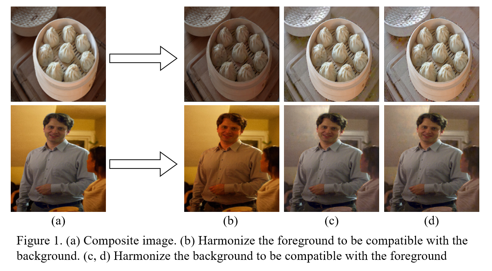
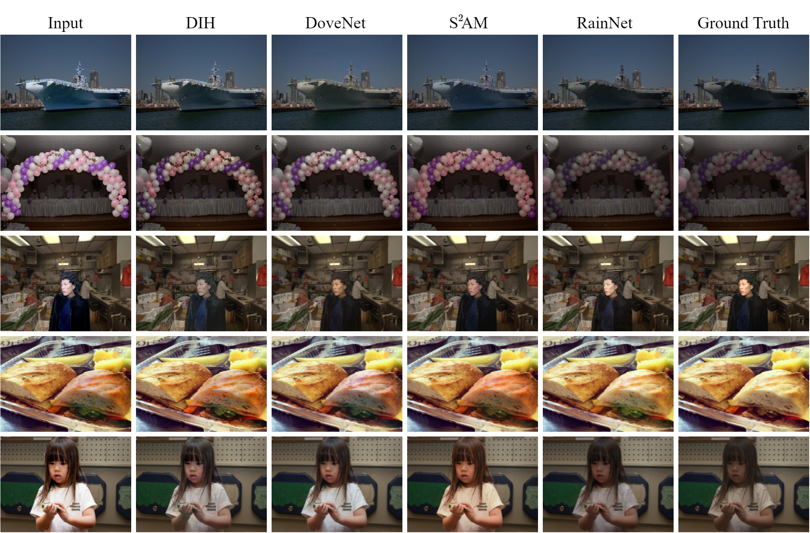
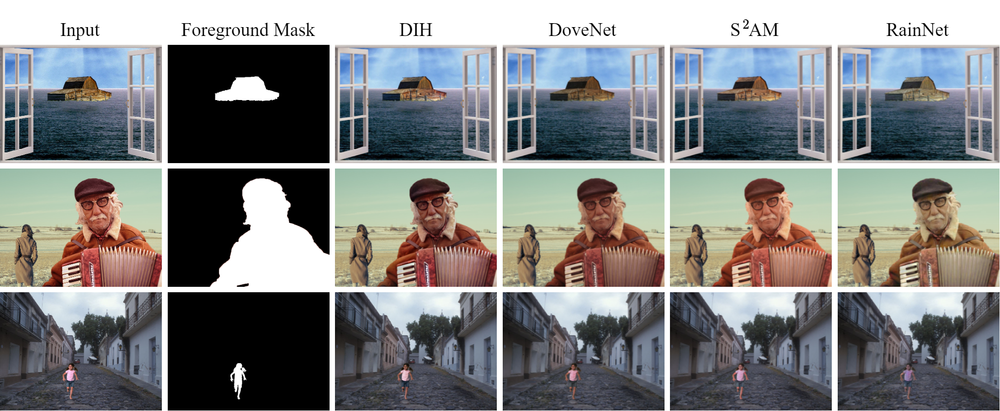

# RainNet &mdash; Official Pytorch Implementation



**Region-aware Adaptive Instance Normalization for Image Harmonization**<br>
Jun Ling, Han Xue, Li Song*, Rong Xie, Xiao Gu

Paper: [link](https://arxiv.org/abs/2106.02853)<br>
Video: [link](https://youtu.be/K15NKUpf_1w)

---

### Table of Contents
1. [Introduction](#introduction)
1. [Preparation](#preparation)
1. [Usage](#usage)
1. [Results](#results)
1. [Citation](#citation)
1. [Acknowledgement](#acknowledgement)


### Introduction
*This work treats image harmonization as a style transfer problem. In particular, we propose a simple yet effective Region-aware Adaptive Instance Normalization (RAIN) module, which explicitly formulates the visual style from the background and adaptively applies them to the foreground. With our settings, our RAIN module can be used as a drop-in module for existing image harmonization networks and is able to bring significant improvements. Extensive experiments on the existing image harmonization benchmark datasets shows the superior capability of the proposed method.*


## Preparation
### 1. Clone this repo:
```bash
git clone https://github.com/junleen/RainNet
cd RainNet
```

### 2. Requirements
* Both Linux and Windows are supported, but Linux is recommended for compatibility reasons.
* We have tested on Python 3.6 with PyTorch 1.4.0 and PyTorch 1.8.1+cu11. 

install the required packages using pip: 
```bash
pip3 install -r requirements.txt
```
or conda:
```bash
conda create -n rainnet python=3.6
conda activate rainnet
pip install -r requirements.txt
```
### 3. Prepare the data

* Download [iHarmony4](https://github.com/bcmi/Image-Harmonization-Dataset-iHarmony4) dataset and extract the images. Because the images are too big in the origianl dataset, we suggest you to resize the images (eg, 512x512, or 256x256) and save the resized images in your local device. 
* We provide the code in `data/preprocess_iharmony4.py`. For example, you can run:
    ```bash
    python data/preprocess_iharmony4.py --dir_iharmony4 <DIR_of_iHarmony4> --save_dir <SAVE_DIR> --image_size <IMAGE_SIZE>
    ```
    This will help you to resize the images to a fixed size, eg, `<image_size, image_size>`. If you want to keep the aspect ratio of the original images, please run:
    ```bash
    python data/preprocess_iharmony4.py --dir_iharmony4 <DIR_of_iHarmony4> --save_dir <SAVE_DIR> --image_size <IMAGE_SIZE> --keep_aspect_ratio
    ```

### 4. Download our pre-trained model

* Download the pretrained model from [Google Drive](https://drive.google.com/drive/folders/1NMvHbnD1kW-j1KKMxEb9R9IR5drMK3GQ?usp=sharing), and put `net_G.pth` in the directory `checkpoints/experiment_train`. You can also save the checkpoint in other directories and change the `checkpoints_dir` and `name` in `/util/config.py` accordingly. 

## Usage
### 1. Evaluation

We provide the code in `evaluate.py`, which supports the model evaluation in [iHarmony4](https://github.com/bcmi/Image-Harmonization-Dataset-iHarmony4) dataset.

Run: 
```bash
python evaluate.py --dataset_root <DATA_DIR> --save_dir evaluated --batch_size 16 --device cuda 
```
If you want to save the harmonized images, you can add `--store_image` at the end of the command. The evaluating results will be saved in the `evaluated` directory. 

### 2. Testing with your own examples

In this project, we also provide the easy testing code in `test.py` to help you test on other cases. However, you are required to assign image paths in the file for each trial. For example, you can follow:
```python
comp_path = 'examples/1.png' or ['examples/1.png', 'examples/2.png']
mask_path = 'examples/1-mask.png' or ['examples/1-mask.png', 'examples/2-mask.png']
real_path = 'examples/1-gt.png' or ['examples/1-gt.png', 'examples/2-gt.png']
```
If there is no groundtruth image, you can set `real_path` to `None`

### 3. Training your own model

Please update the command arguments in `scripts/train.sh` and run:
```bash
bash scripts/train.sh
```

## Results



## Citation
If you use our code or find this work useful for your future research, please kindly cite our paper:
```bibtex
@inproceedings{ling2021Rainnet,
    title     = {Region-aware Adaptive Instance Normalization for Image Harmonization}, 
    author    = {Ling, Jun and Xue, Han and Song, Li and Xie, Rong and Gu, Xiao}, 
    booktitle = {IEEE Conference on Computer Vision and Pattern Recognition},
    year      = {2021}
}
```

## Acknowledgement
For some of the data modules and model functions used in this source code, we need to acknowledge the repo of [DoveNet](https://github.com/bcmi/Image-Harmonization-Dataset-iHarmony4/tree/master/DoveNet) and [pix2pix](https://github.com/junyanz/pytorch-CycleGAN-and-pix2pix). 
